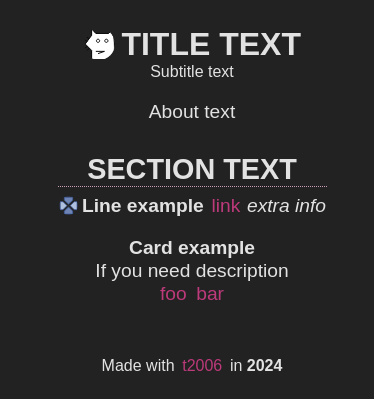

# t2006

_By Cinnabar Forge_

**DISCLAIMER**: Until version 1.0.0, all versions below should be considered unstable and are subject to change.

A small, low-opinionated static site generator with sections and items.

You can change sections quantity, text, images, colors (dark-theme ready) and fonts for headers and text.



Sample site: [page](https://timurrin.github.io/) and [repo](https://github.com/TimurRin/timurrin.github.io)

## Getting Started

### Installation

Install t2006 globally using npm:

```bash
npm install -g t2006
```

This will make the `npx t2006` or `t2006` commands available in your terminal.

### Configuration

t2006 is driven by two main configuration files:

- `data.json`: Defines the structure and content of your site.
- `style.json`: Specifies the visual styling of your site.

Both files examples can be found inside `sample` folder.

#### `data.json` structure from the screenshot

```json
{
  "title": "Title text",
  "description": "HTML meta description text",
  "header": {
    "image": "https://dev.w3.org/SVG/tools/svgweb/samples/svg-files/why.svg",
    "title": "TITLE TEXT",
    "subtitle": "Subtitle text",
    "about": "About text"
  },
  "sections": [
    {
      "title": "SECTION TEXT",
      "items": [
        {
          "name": "Line example",
          "image": {
            "path": "https://dev.w3.org/SVG/tools/svgweb/samples/svg-files/beacon.svg"
          },
          "links": [
            { "text": "link", "url": "https://example.com/" }
          ],
          "extra": "extra info"
        },
        {
          "name": "Card example",
          "text": "If you need description",
          "links": [
            { "text": "foo", "url": "https://example.com/" },
            { "text": "bar", "url": "https://example.com/" }
          ]
        }
      ]
    }
  ]
}
```

### Usage

```bash
npx t2006 --input "path/to/json/data/files" --output "path/to/html/output"
```

#### `--input <path>`

**path**: A path with data.json and style.json.

#### `--output <path>`

**path**: A path where index.html and style.css are generated.

## Contributing

Contributions are welcome! If you find any issues or have suggestions for improvements, feel free to open an issue or create a pull request.

Fork, clone and install:

```bash
npm ci
```

### Road to 1.0

- ⚠️ Tests
- ❌ GitHub Actions script
- ❌ Special pages to present your content in the advanced way
- ❌ Localization

## License

t2006 is licensed under the ISC License - see the [LICENSE](LICENSE) file for details.

## Authors

- Timur Moziev ([@TimurRin](https://github.com/TimurRin))
